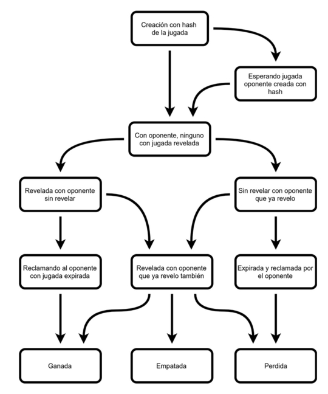

# Rock Paper Scissors on Blockchain

Este es mi trabajo practico final del curso de *Desarrolladores de Blockchain* dictado por Leandro Rawicz *(CoinFabrik)* en la Universidad de Palermo. Fecha de entrega 2019-07-17.

Se trata de un *smart contract* que permitiría jugar al clásico juego de Piedra Papel o Tijera.


##Links  donde puede encontrar este documento

* [https://bitbucket.org/jbokser/rock_paper_scissors/src/default/README.md](https://bitbucket.org/jbokser/rock_paper_scissors/src/default/README.md)
* [https://tinyurl.com/y3pjfxha](https://tinyurl.com/y3pjfxha)


##Descripción funcional


###Diagrama de estados de una jugada

 


##Código fuente del smart contract

El código fuente del contrato puede encontrarle en:

* Publicado en [bitbucket.org](https://bitbucket.org/jbokser/rock_paper_scissors/src/default/source/rock_paper_scissors.sol)
* Publicado en [etherscan.io](https://rinkeby.etherscan.io/address/0x2306c5a10b2d8e1598cc6357574fd924ba8b6cbb#contracts) en la `testnet rinkeby`


##Contrato en la Testnet (Rinkeby)

```python
Address = 0x2306c5A10b2D8e1598CC6357574FD924Ba8B6CBb
```

Link para [verlo en `etherscan.io`](https://rinkeby.etherscan.io/address/0x2306c5a10b2d8e1598cc6357574fd924ba8b6cbb) 


##Funciones mas importantes del contrato

Función para crear una jugada con un hash
```javascript
function makeAmove(bytes32 _hash) public payable returns (uint _index) {}
```
Función para exponer jugada creada con la función anterior
```javascript
function showMyMove(uint _index, string memory _nonce) public {}
```
Función para reclamar una jugada expirada 
```javascript
function claimAnExpiredMove(uint _index) public {}
```
Función para obtener el estado de una jugada
```javascript
enum Result {lose, tie, win, bad, wait, opponent_not_showed, not_showed}
function seeAmove(uint _index) public view returns (Result) {}
```


##Shell

`shell.py` es una interface simple de linea de comandos desarrollada en `python3` que permite interactuar con el *smart contract* de este proyecto. 

 

Para mas información de esta herramienta ver el archivo `README.md` dentro de la carpeta `utils/` de este proyecto.

También puede [ver un cast](https://asciinema.org/a/3hfOdEYTRXyxszLmYa0XXETc3) de como se usa en `asciinema.org`

[](https://asciinema.org/a/3hfOdEYTRXyxszLmYa0XXETc3)


##Licencia

Este trabajo está bajo una [Licencia Creative Commons Atribución-NoComercial-CompartirIgual 4.0 Internacional](http://creativecommons.org/licenses/by-nc-sa/4.0/).

Desarrollado por **Juan S. Bokser** [<juan.bokser@gmail.com>](mailto:juan.bokser@gmail.com)

 
