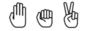
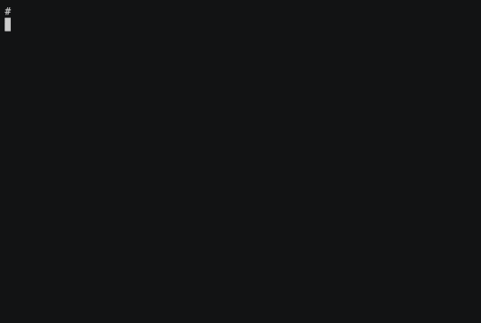

# Rock Paper Scissors on Blockchain

Este es mi trabajo practico final del curso de *Desarrolladores de Blockchain* dictado por Leandro Rawicz *(CoinFabrik)* en la Universidad de Palermo. Fecha de entrega 2019-07-17.

Se trata de un *smart contract* que permitiría jugar al clásico juego de Piedra Papel o Tijera. También se incluye un pequeño programa cliente (`shell.py`) para interactuar con este contrato a través de [`infura.io`](https://infura.io/).


##Links  donde puede encontrar este documento

* [https://bitbucket.org/jbokser/rock_paper_scissors/src/default/README.md](https://bitbucket.org/jbokser/rock_paper_scissors/src/default/README.md)
* [https://tinyurl.com/y3pjfxha](https://tinyurl.com/y3pjfxha)


##Descripción funcional del contrato

El contrato permite a dos personas que no necesitan conocerse jugar al clásico *"Piedra, papel o tijera"*

Un jugador inicia la jugada y queda a la espera de un oponente o en su defecto se transforma en el oponente de otro jugador que estaba en esa espera.

La jugada se realiza con un `hash` de una concatenación de la movida elegida (`piedra`, `papel` o `tijera`) y una palabra secreta a la que llamaremos `nonce` que luego se utilizará solo para revelar la jugada.

El `nonce` que elijamos deberá variar en cada jugada o se tornara fácil de predecir.

Al momento de realizar la jugada se debe pagar la apuesta.

Cuando ambos (el jugador y su oponente) ya realizaron sus jugadas con el `hash` tienen un periodo máximo para revelar sus jugadas con el `nonce` con la que la construyeron.

Si alguno de los dos no revela la jugada en el periodo estipulado el otro podrá reclamar haber ganado.

Cuando el último de ambos jugadores que le faltaba revelar su jugada, lo hace, o el jugador que si revelo su jugada reclama que su oponente no lo hizo en el tiempo adecuado, el contrato evaluará quien es el ganador y le trasferirá el premio al mismo. Ademas contabilizará la comisión que se quedará el dueño del contrato.

Si hay un empate se les devuelve las apuestas a ambos jugadores.

Por último, en el momento que el dueño del contrato lo decida, podrá retirar las comisiones acumuladas.


###Diagrama de estados de una jugada

 


##Código fuente del smart contract

El código fuente del contrato puede encontrarle en:

* Publicado en [bitbucket.org](https://bitbucket.org/jbokser/rock_paper_scissors/src/default/source/rock_paper_scissors.sol)
* Publicado en [etherscan.io](https://rinkeby.etherscan.io/address/0x2306c5a10b2d8e1598cc6357574fd924ba8b6cbb#contracts) en la `testnet rinkeby`

Para clonar este repositorio con todos los fuentes del proyecto debe correr el siguiente comando:

```bash
$ hg clone https://jbokser@bitbucket.org/jbokser/rock_paper_scissors
```


##Contrato en la Testnet (Rinkeby)

```python
Address = 0x2306c5A10b2D8e1598CC6357574FD924Ba8B6CBb
```

Link para [verlo en `etherscan.io`](https://rinkeby.etherscan.io/address/0x2306c5a10b2d8e1598cc6357574fd924ba8b6cbb) 


##Funciones mas importantes del contrato

Función para crear una jugada con un hash
```javascript
function makeAmove(bytes32 _hash) public payable returns (uint _index) {}
```
Función para exponer jugada creada con la función anterior
```javascript
function showMyMove(uint _index, string memory _nonce) public {}
```
Función para reclamar una jugada expirada 
```javascript
function claimAnExpiredMove(uint _index) public {}
```
Función para obtener el estado de una jugada
```javascript
enum Result {lose, tie, win, bad, wait, opponent_not_showed, not_showed}
function seeAmove(uint _index) public view returns (Result) {}
```


##Programa cliente para interactuar con este contrato

`shell.py` es una interface simple de linea de comandos desarrollada en `python3` que permite interactuar con el *smart contract* de este proyecto. 

 

Para mas información de esta herramienta ver el archivo [`README.md`](https://bitbucket.org/jbokser/rock_paper_scissors/src/default/utils/README.md) dentro de la carpeta [`utils/`](https://bitbucket.org/jbokser/rock_paper_scissors/src/default/utils/) de este proyecto.

También puede [ver un cast](https://asciinema.org/a/3hfOdEYTRXyxszLmYa0XXETc3) de como se usa en `asciinema.org`

[](https://asciinema.org/a/3hfOdEYTRXyxszLmYa0XXETc3)


##Mejoras a considerar en el futuro

* Medir el tiempo con el numero de bloque y no con el `timestamp`. Si la `blockchain` se pone lenta no es culpa de los jugadores y se pueden hacer reclamos a jugadas expiradas que no corresponden.
* Darle soporte para apuestas no fijas.
* Mantener un *top 10* de ganadores, donde se acumulan 2 puntos por jugada ganada y 1 punto por jugada empatada.


##Licencia

Este trabajo está bajo una [Licencia Creative Commons Atribución-NoComercial-CompartirIgual 4.0 Internacional](http://creativecommons.org/licenses/by-nc-sa/4.0/).

Desarrollado por **Juan S. Bokser** [<juan.bokser@gmail.com>](mailto:juan.bokser@gmail.com)

 
